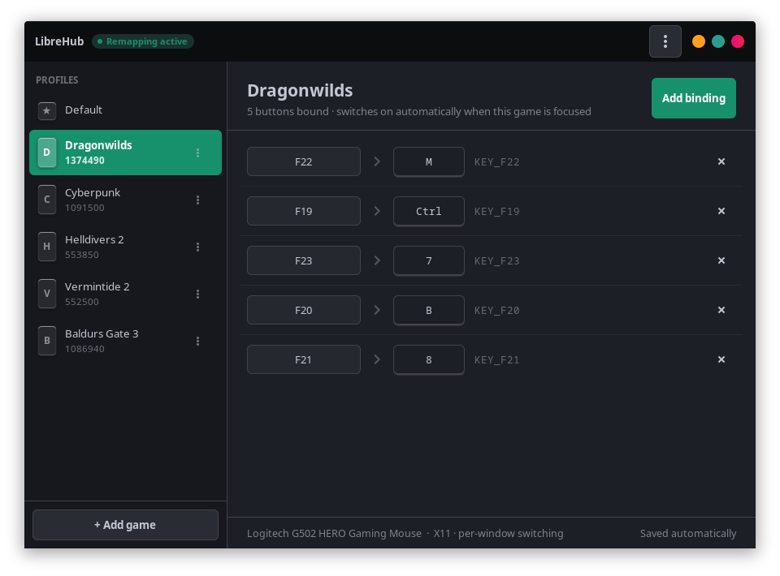
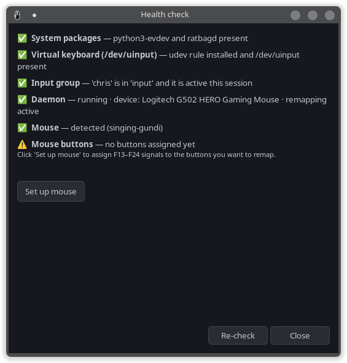
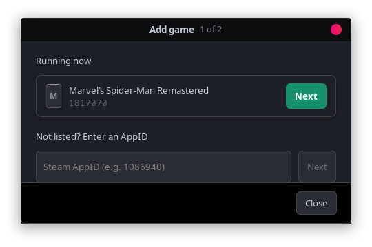
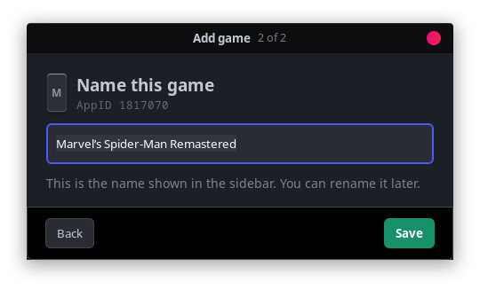
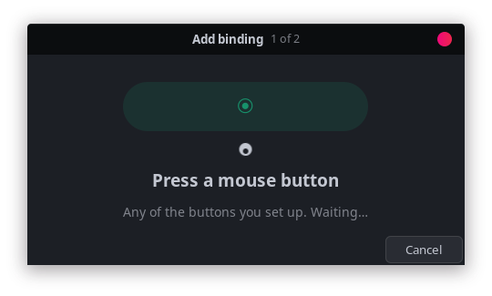

# LibreHub

**A free Logitech G HUB alternative for Linux, focused on per game mouse button remapping.**

LibreHub lets you assign your gaming mouse buttons to keyboard keys, with a different profile for every game. When you launch a Steam game, LibreHub switches to that game's profile automatically.

Works with the Logitech G502 and other Logitech gaming mice, plus any mouse that ratbagd supports. Although, I have only personally tested on my own G502 and no other models.



## What you need

* **A mouse:** any Logitech gaming mouse with programmable buttons, or another mouse that ratbagd supports.
* **Your display server:** X11 gives the most precise switching. Wayland works too, with a slightly simpler switching method described further down.
* **Steam** on Linux.
* **Python** 3.10 or newer.
* **A few system packages.** The installer checks for these and tells you the exact names for your distro if any are missing.

| What it is for | Debian, Ubuntu, Mint (apt) | Fedora, RHEL (dnf) |
| --- | --- | --- |
| Python GTK3 bindings | `python3-gi` | `python3-gobject` |
| GTK3 data | `gir1.2-gtk-3.0` | `gtk3` |
| The `ratbagctl` tool | `ratbagd` | `libratbag-ratbagd` |
| evdev bindings | `python3-evdev` | `python3-evdev` |
| PolicyKit, usually already installed | `policykit-1` | `polkit` |

Fedora, all in one line:

```bash
sudo dnf install python3-gobject gtk3 python3-evdev libratbag-ratbagd
```

## Installing it

```bash
./install.sh
```

Here is what that does:

1. Installs the `librehub`, `librehub-daemon`, `librehub-tray` and `librehub-doctor` commands.
2. Installs the application icon and menu entry.
3. Adds a udev rule so the background helper can reach `/dev/uinput`. This needs `sudo`.
4. Adds your user to the `input` group. This also needs `sudo`.
5. Sets up the background helper as a systemd user service and starts it.

**One important note.** After the install finishes, log out and log back in. The `input` group only takes effect on a fresh login. The helper starts on its own once you are back in.

### The built in health check

The app has a health check that does all of the above for you and tells you plainly if something is half finished. It opens by itself the first time you run the app. You can also open it whenever you want from the app menu, the button at the top right of the window, under **Run health check**.



It checks each requirement and offers a one click fix where it can:

| Check | Fix it offers |
|-------|-------------|
| System packages | Runs the setup with a single password prompt |
| The `/dev/uinput` rule | Runs the setup |
| The `input` group, both joined and active | Joins you, then prompts you to log out and back in |
| The helper running and remapping | Start or restart the helper |
| Mouse found and buttons assigned | Set up the mouse |

That "joined the group but not active until you log back in" case is the most common first time snag, so the app calls it out clearly.

Prefer the terminal? Run the same checks there:

```bash
librehub-doctor
```

## Using it

### Set up your mouse once

Each button you want to use needs to send a unique signal that nothing else on your system uses. LibreHub handles this with a guided dialog so you do not have to think about it:

1. Launch the app:

   ```bash
   librehub
   ```

2. Open the app menu, the button at the top right of the window, and choose **Set up mouse**. LibreHub scans your mouse and lists each button. Tick the ones you want to manage. It leaves your normal left, right, and middle clicks alone.

3. Click OK. LibreHub programs the chosen buttons into your mouse and confirms when it is done.

4. Restart the helper if it asks you to, either with the button in the dialog or:

   ```bash
   systemctl --user restart librehub-daemon
   ```

After this, the **Add binding** flow can see those buttons.

### Add a game

1. Click **+ Add game** at the bottom of the left pane.

2. If the game is open, it shows up under **Running now**. Click **Next** beside it. If it is not listed, type its Steam AppID in the box underneath and click **Next**. You can look an AppID up at steamdb.info.

   

3. Give the profile a name. LibreHub fills in the name from your Steam library, so usually you can leave it alone. Click **Save**.

   

Nothing is saved until you press Save, so picking the wrong game costs you nothing. To rename a game later, or to copy its bindings to another game, use the menu button on its row in the left pane.

### Bind the buttons

1. Click the game in the left list.

2. Click **Add binding**, then press the physical mouse button you want to use.

   

3. Now press the key you want that button to send, like `m`, `4`, `space`, or `q`. The binding appears in the list.

4. Repeat for the other buttons. There is no save step, your changes are written as you make them.

To remove a binding, click the **✕** at the end of its row.

### Automatic switching

Once a game is set up, LibreHub watches which game has focus and turns on that game's buttons when it launches. When no set up game is focused, it falls back to your default buttons.

**X11 and Wayland.** On X11, LibreHub reads exactly which window is focused, so your buttons apply only while the game is actually in front. Wayland does not let apps ask which window is focused without special permission, so there LibreHub uses a simpler rule: if exactly one game you have set up is running, it turns that game's buttons on. It figures out which session you are in and logs the mode it chose. Two small things to know on Wayland: your buttons stay on while the game is running even if you tab away, and if two set up games run at the same time it cannot tell which you mean, so it uses your default.

### Appearance and the tray

The app menu has **Preferences**, where you can force a light or dark look instead of following your desktop, keep the window above fullscreen games, start the helper at login, and turn the tray icon on or off.

## How it works

LibreHub splits the job into two simple parts.

**The signal.** Each managed button is set to send a unique function key that nothing else uses, one of F13 through F24. These live in an always on profile on the mouse itself, which is how LibreHub gets around the roughly five profile limit built into the hardware. Your normal clicks and scroll wheel are untouched.

**The translation.** A small background helper watches for those function keys coming in, looks up the buttons for whatever game you are playing, and sends the real keys you chose. It checks for a game switch about twice a second. It never touches your mouse movement or your clicks, only the button to key translation.

## Troubleshooting

Start with the built in health check, or run `librehub-doctor`. It points at the exact thing that is not ready and offers the fix.

**The app says the helper is not running, but it looks like it is.**
The status updates live, so a startup message usually clears on its own. If it sticks around, start the helper with the commands below.

**It says running but remapping is off.**
The helper is up but could not grab the mouse signal, almost always because the `input` group is not active in this session yet. Log out and back in if you just installed, then restart it:

```bash
systemctl --user restart librehub-daemon
```

**The helper will not start.**

```bash
systemctl --user status librehub-daemon.service
systemctl --user enable --now librehub-daemon.service
```

**Permission errors on `/dev/uinput`.**
Check that you are in the `input` group with `id -nG | grep input`. If you are not, run `install.sh` again and log out and back in.

**Games show up as "Game 1086940" instead of their name.**
LibreHub reads game names from your Steam library folders, including the Flatpak version of Steam. If a game is not installed locally there is no name to read, so you can type one yourself when you add it.

**Mouse not found.**

```bash
ratbagctl list
journalctl --user -u librehub-daemon.service -f
```

## Frequently asked questions

### Does Logitech G HUB work on Linux?

No. Logitech does not ship G HUB for Linux, and there is no official replacement. LibreHub covers the part most people used it for: assigning mouse buttons per game.

### What is the Linux equivalent of Logitech G HUB?

For onboard settings like DPI and lighting, Piper and ratbagd. Neither switches profiles per game, which is what LibreHub adds.

### Can I remap Logitech G502 side buttons on Linux?

Yes. That is the case LibreHub was built and tested against.

### Does it work with mice from other brands?

Any mouse ratbagd supports should work, though I have only tested a G502 myself. Run `ratbagctl list` to see whether yours is detected.

## Contributing

LibreHub is open source. Bug reports, feature ideas, and pull requests are all welcome.

## License

MIT. See `LICENSE`.

## Author

Chris Mackall.
